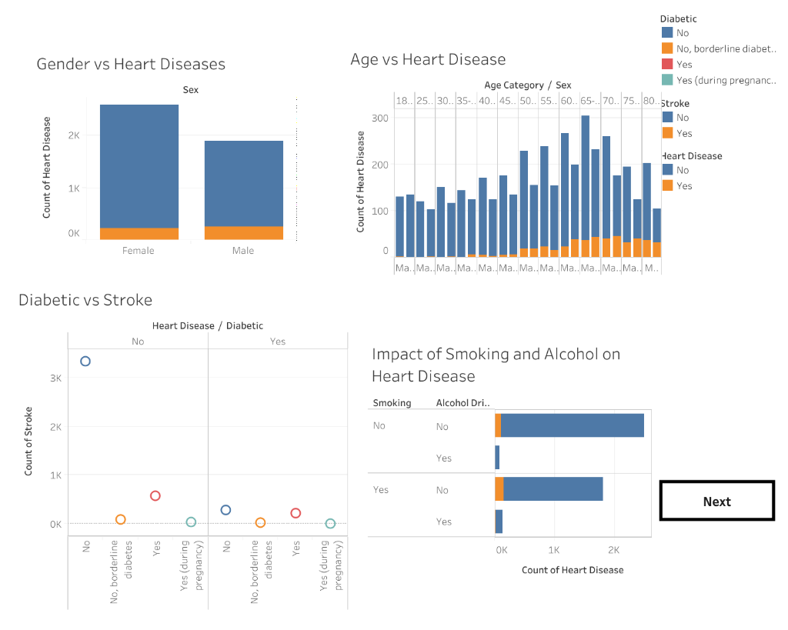
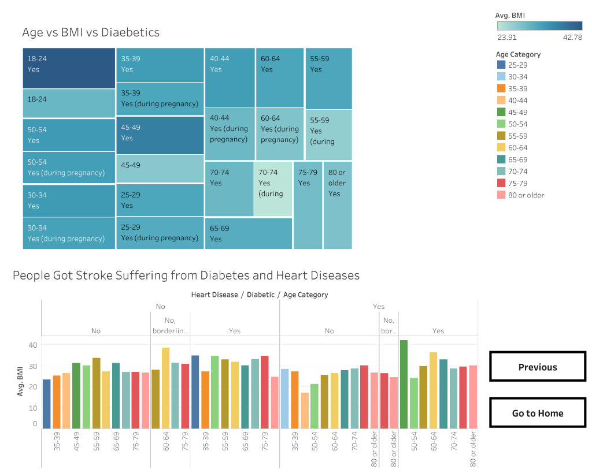
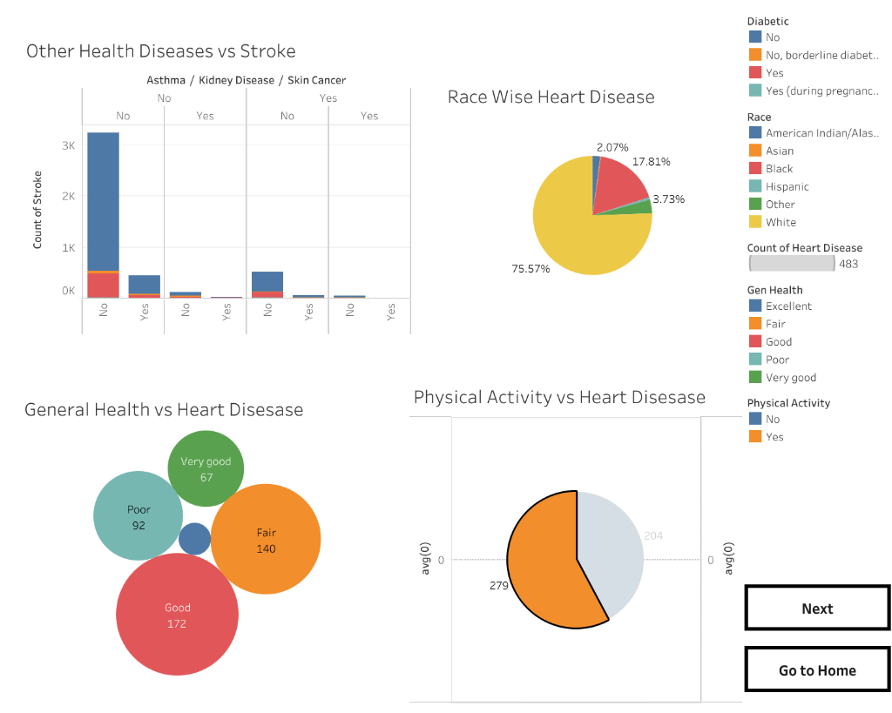

# 🫀 Heart Disease Analytics Platform

A comprehensive Heart Disease Analytics Platform developed using Tableau and a responsive web application (HTML, CSS, and JavaScript) to visualize, analyze, and present key insights from clinical and behavioral healthcare data.

---

## 📌 Project Overview

This project analyzes patient health metrics data to identify important trends and patterns affecting chronic heart conditions. Interactive Tableau dashboards and stories are used to present meaningful insights, while a responsive website provides an intuitive, easy-to-use interface for viewing the project components and calculating cardiovascular risk.

---

## 🌐 Live Demo

| Component | URL |
| :--- | :--- |
| **📖 Primary: Tableau Story** | [View Tableau Story](https://public.tableau.com/app/profile/k.bhargav/viz/Book4_17836030139220/Story1?publish=yes) |
| **📊 Secondary: Tableau Dashboard** | [View Tableau Dashboard](https://public.tableau.com/app/profile/k.bhargav/viz/Book1_17836025117010/Dashboard1?publish=yes) |

---

## 📸 Dashboard Visualizations

### 🫀 Demographics & Case Volume Dashboard
Displays the distribution of patients by age, gender, stroke history, and the combined impact of smoking and alcohol usage.



### 🏡 Clinical Profile Analysis Dashboard
Visualizes patient metrics mapping Age vs. BMI vs. Diabetes status alongside specific stroke incidence correlations.



### 🏃 Lifestyle & General Health Risk Factors
Tracks correlation between other medical conditions (asthma, kidney disease, skin cancer), race, general health, physical activity, and heart disease.



---

## 🎯 Objectives

- Analyze chronic heart disease market datasets to identify risk correlations.
- Visualize clinical Key Performance Indicators (KPIs) via interactive panels.
- Pinpoint critical factors and lifestyle behaviors affecting cardiac health risks.
- Develop interactive dashboards and multi-perspective stories.
- Present clinical insights through a responsive website.

---

## 🛠️ Technologies Used

- **Data Analytics & Visualization**: Tableau, Tableau Public
- **Frontend Core**: HTML5, CSS3, JavaScript (ES6+), Bootstrap
- **Version Control**: Git & GitHub

---

## 📂 Project Structure

```plaintext
Heart-Disease-Analysis/
│
├── Data/                              # Cleaned patient cardiovascular datasets
├── Project Demonstration/             # Demonstration documents and video metadata
├── screenshots/                       # Dashboard screenshots and visualization images
│   ├── clinical_profile_dashboard.png
│   ├── demographics_cases_dashboard.png
│   └── lifestyle_risk_dashboard.png
├── Templates/                         # Project templates categorized by phases
│   ├── 1. Brainstorming & Ideation/   # Brainstorming templates and problem statements
│   ├── 2. Requirement Analysis/       # Solution requirements and technology stack files
│   ├── 3. Project Design Phase/       # Problem-solution fit and architecture templates
│   ├── 4.Project Planning Phase/      # Project planning templates
│   ├── 5. Project Development Phase/  # Dashboard and development phase templates
│   ├── 6. Performance Testing/        # Performance testing templates
│   └── 7.Doc and Demo/                # Final reports and document templates
├── src/                               # Website application frontend code
│   ├── Assests/                       # Frontend styling, assets, and visual pages
│   ├── app.py                         # Backend integration script
│   └── index.html                     # Main dashboard page
└── README.md                          # Project documentation
```

---

## 📊 Project Components

### 📁 Dataset
Contains patient cardiovascular records utilized for risk segmentation and aggregate metrics computation.

### 📈 Tableau Dashboard
An interactive Tableau workspace showcasing:
* Total Case Volume Count
* Average Body Make Index (BMI) Metrics
* Stroke History Overlap Area
* Vulnerable Age Group Category Distribution
* Cardiovascular Disease Incidence relative to Lifestyle Risk variables (Smoking, Alcohol usage)
* A structured **Tableau Story** presenting findings, clinical insights, and strategic conclusions.

### 📦 Tableau Workbook
Includes the packaged Tableau workbook (`.twbx`) for easy offline exploration and native modification.

---

## ✨ Key Features

- **Interactive Tableau Dashboard Layout**: Fluid integration of Tableau panels and stories.
- **Story-based Diagnostic Visualizations**: Narrative-driven clinical tracking layouts.
- **Responsive Web Interface Framework**: Dynamic website for immediate project presentation.
- **Clean Decoupled Project Structure**: Organized project layout spanning documentation and code.
- **Easy Navigation Design**: Simple layout for accessing dashboards and stories.

---

## 🚀 How to Run

1. **Clone the Repository**:
   ```bash
   git clone https://github.com/Bhargavkamakula/Heart-Diseases-Analysis.git
   ```

2. **Open the Project**:
   * Navigate to the project directory.
   * Review documentation under the design and requirement folders.
   * View final documents and templates in the `src/` folder.

3. **Open Tableau Workbook**:
   * Open the `.twbx` workbook natively inside Tableau Desktop or Tableau Reader to view the worksheets.

---

## 👨‍💻 Team Members

| Name | Roll Number |
| :--- | :--- |
| **Kamakula Bhargav** | `[Insert Roll Number]` |
| **Member 2** | `[Insert Roll Number]` |
| **Member 3** | `[Insert Roll Number]` |
| **Member 4** | `[Insert Roll Number]` |
| **Member 5** | `[Insert Roll Number]` |

---

## 🎯 Project Outcomes

- Successfully analyzed and structured multi-attribute patient metadata.
- Engineered interactive, multi-sheet dashboards and diagnostic tracking stories.
- Designed a web environment structure for project asset presentation.
- Extracted meaningful clinical correlations between chronic health indicators and cardiac risks.

---

## 🔮 Future Enhancements

- **Machine Learning Integrations**: Predict patient health risk scores using advanced classification models.
- **Real-Time EMR Pipeline**: Connect live Electronic Medical Record data sources directly.
- **Geospatial & Clustering Analysis**: Map geographical clusters of cardiovascular incidents.
- **Advanced Diagnostic Filters**: Implement deep dynamic filters for clinical metrics.
- **Mobile Grid Optimization**: Enhance layout responsiveness specifically for smaller handheld viewports.

---

## 📚 Learning Outcomes

- Built interactive tracking dashboards and stories in Tableau.
- Mastered clean dataset parsing, data formatting, and features structuring.
- Improved diagnostic visualization mapping and reporting configurations.
- Engineered a modular frontend dashboard architecture using standard HTML, CSS, and JS.
- Practiced distributed collaboration using Git and GitHub workflows.

---

## 🙏 Acknowledgements

- **Tableau** (Public & Desktop Developer Ecosystem)
- **BootstrapMade** (Website Template Layout Inspiration)
- **GitHub Infrastructure**
- **SmartBridge Platform Services**
- **Vishnu Institute of Technology**

---

## 📜 License

This project was developed exclusively for academic research, learning validation, and professional development benchmarks.
